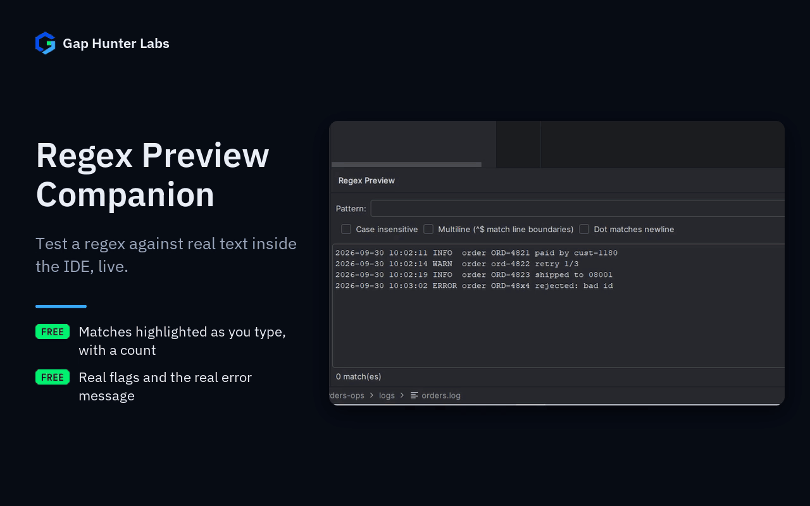

# Regex Preview Companion

IntelliJ-family plugin. A tool window with a pattern field and a
sample-text area — type a regex, type or paste sample text, and every
match is highlighted live as you type, with a real match count. Case
insensitive, multiline, and dot-all flags are real checkboxes, not
something you have to remember inline syntax for.



Each feature on its own:
[Live matches](docs/media/01-live-matches.gif) ·
[Invalid patterns](docs/media/02-invalid-pattern.gif)

## Why it exists

Ports a pattern that's genuinely popular elsewhere (standalone regex
testers are a daily tool for many developers) directly into the IDE,
with no real equivalent already in JetBrains Marketplace (confirmed by
search before building this, not assumed). A deliberate "port a proven
concept" bet — the same documented-exception discipline this follows (same treatment as Refactor Simulator/Bean
Copy Companion and the other plugins built this same session).

## Why built this way

- **Self-contained, never hooked into the IDE's own highlighting
  pipeline.** A dedicated tool window with its own Swing panel and
  `java.util.regex` is a fundamentally simpler, lower-risk integration
  point than trying to render inline hints inside real source files —
  this plugin owns its entire UI surface.
- **An invalid pattern shows the real `PatternSyntaxException`
  message**, never a silent blank or a generic "invalid" — you find
  out exactly what's wrong, where regex101-style tools normally make
  you guess.
- **No debouncing needed.** A single `Pattern.compile` +
  `Matcher.find()` loop against typically-short sample text is cheap
  enough to run on every keystroke honestly — unlike, say, invoking a
  bundler (see this catalog's Import Cost Companion for a plugin where
  that distinction mattered a lot).
- **100% local** — no network call, no account, no telemetry.

## Usage

Open the **Regex Preview** tool window (bottom of the IDE) → type a
pattern → type or paste sample text → matches highlight live.

## Support

- **Bugs and feature requests:** [GitHub Issues](https://github.com/GapHunterLabs/regex-preview-companion/issues)
- **Questions, or custom rules for a team's codebase:** **gaphunterlabs@gmail.com**
- **Security vulnerabilities:** report privately as described in [SECURITY.md](SECURITY.md), not in a public issue.
- **Privacy and network behavior:** [PRIVACY.md](PRIVACY.md)

## Development

```
./gradlew test           # unit tests
./gradlew buildPlugin    # generates build/distributions/*.zip
./gradlew verifyPlugin   # checks compatibility against real IDEs
```

## License

Apache-2.0. See `LICENSE`.
